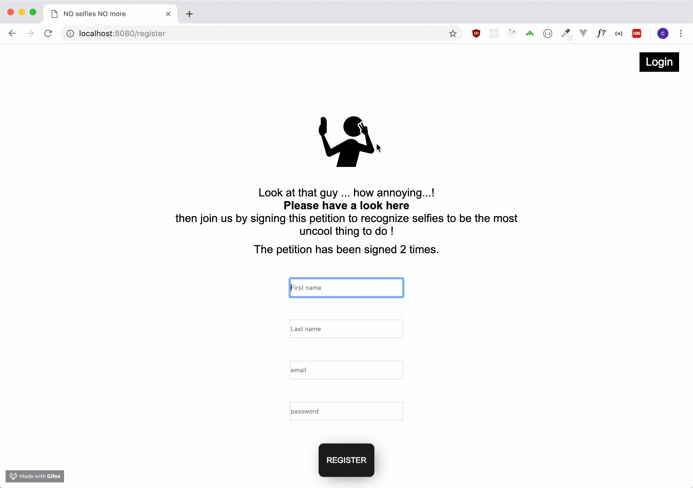
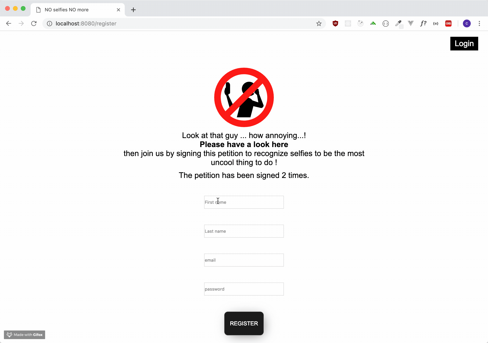
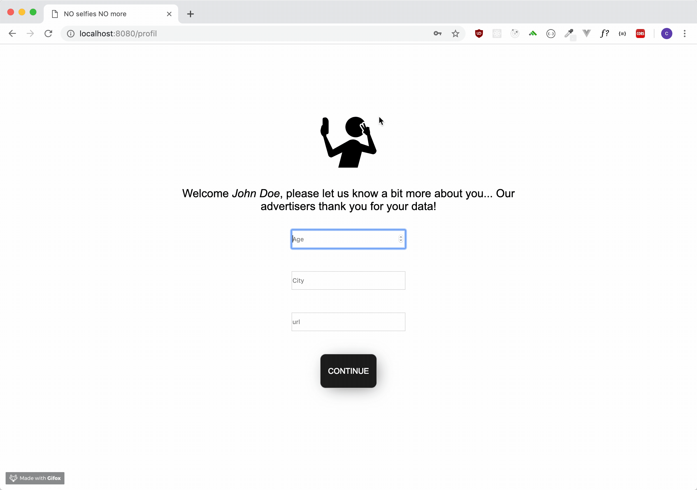
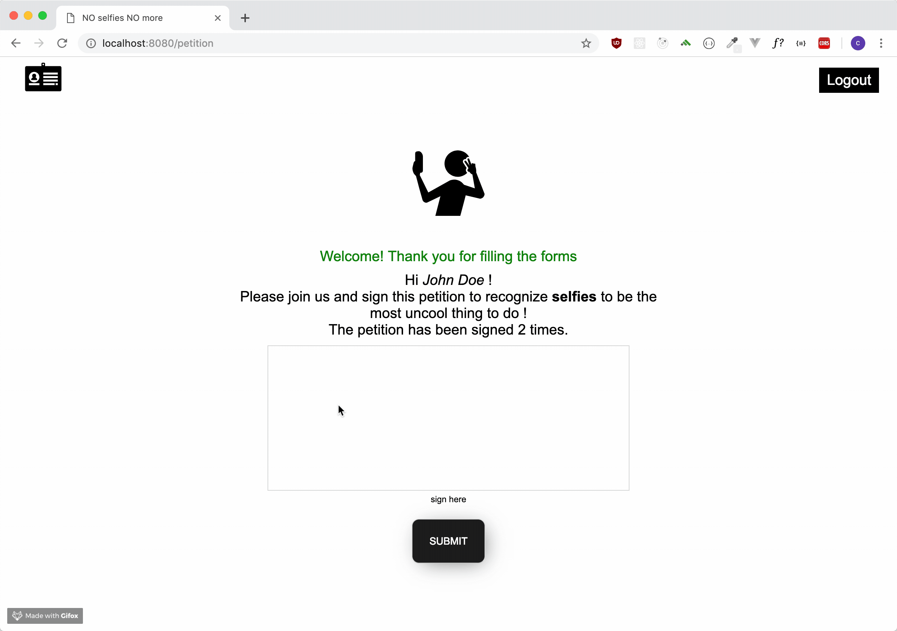
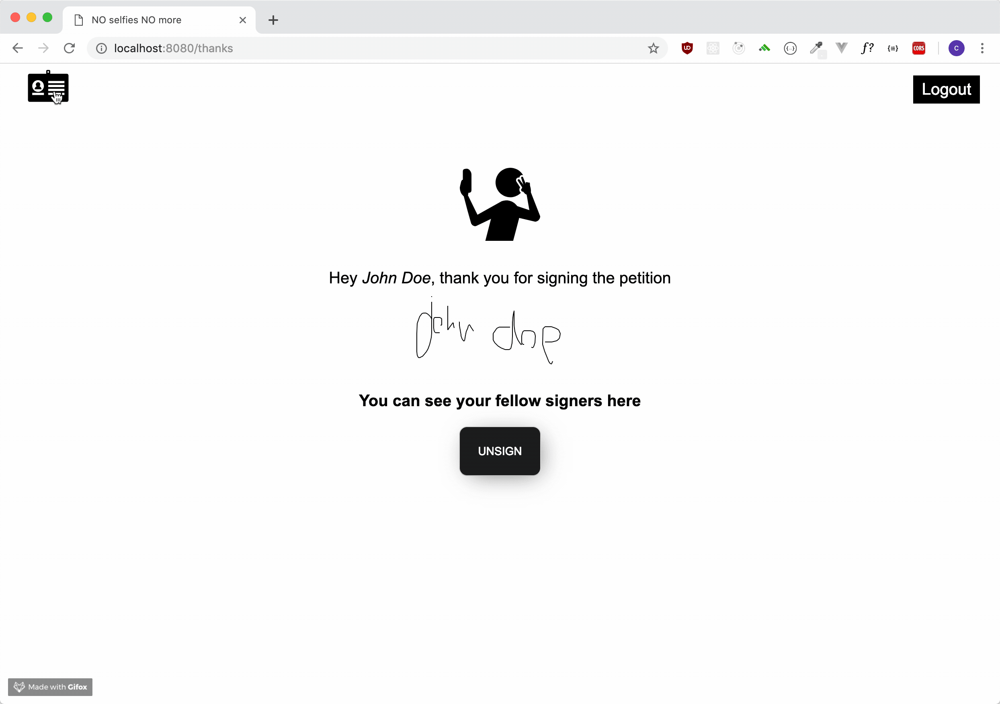
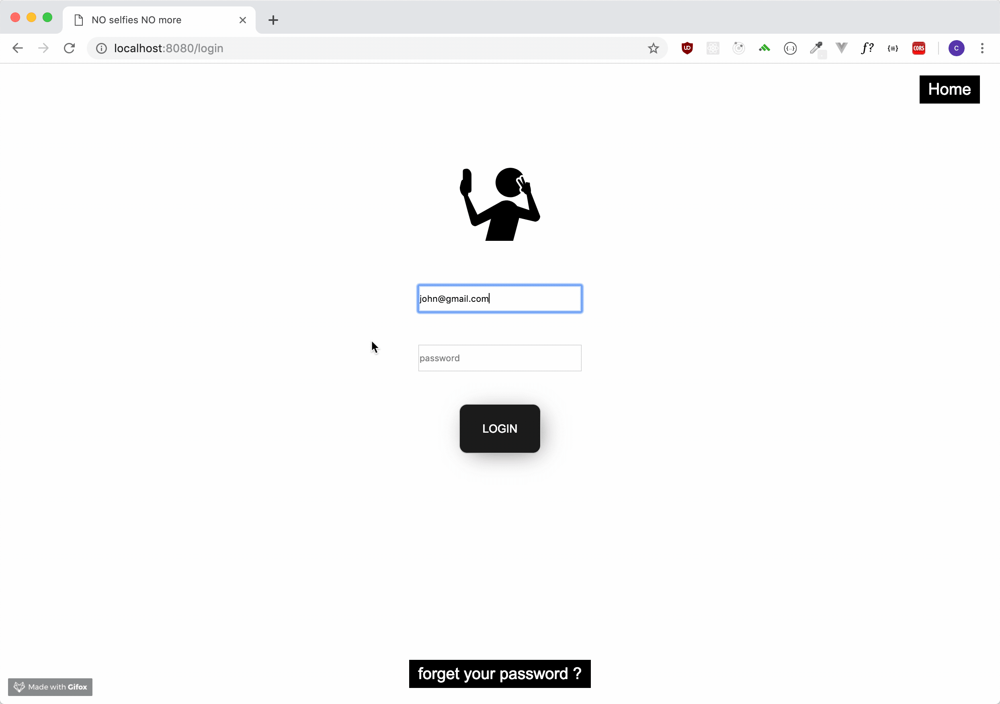

# Petition

I made a petition website, You can sign it to join the forces of people thinking selfies are really an uncool thing to do. If you chnage your mind you can anytime unsign this petition.
You can visit the website here : https://noselfies.herokuapp.com





## Getting Started

You'll have first to register yourself on the website, you will then be ask for more information about you, this step is optionnal but you can also simply edit your profil later.




When you'll be logged in, you will be able to sign the petition, so you'll have access to the list of people that has also signed it.





If you forget your password, you can click on the forget password button in the login page, you wil; then ask for your email, A link will be sent to you so you can reset your password.




### Installing

to install the application on your local machine simply clone the repository to your local machine. 
create a new database and use the files from the SQL folder to create the tables.
Go to the root of your folder

```
npm install
```

then to start the server

```
node index.js
```

## Built With

* Node.js
* Express
* Redis
* JavaScript
* PostgreSQL
* CSS
* HTML

## Authors

* **Christophe Johanny** - *Initial work* - [st-jon](https://github.com/st-jon)

## License

This project is licensed under the MIT License - see the [LICENSE.md](LICENSE.md) file for details

## More Infos

* No selfie people has been hurt during the process of building this application.
* A beautiful hall of fame gallery of selfies is hide in the website...